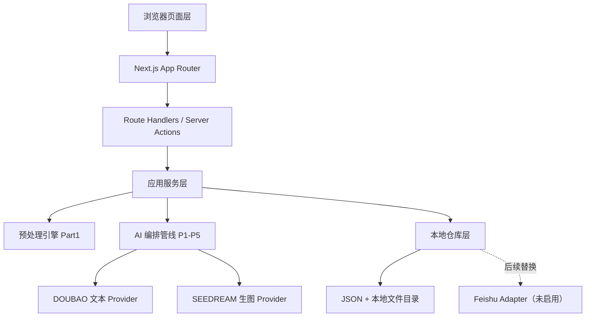
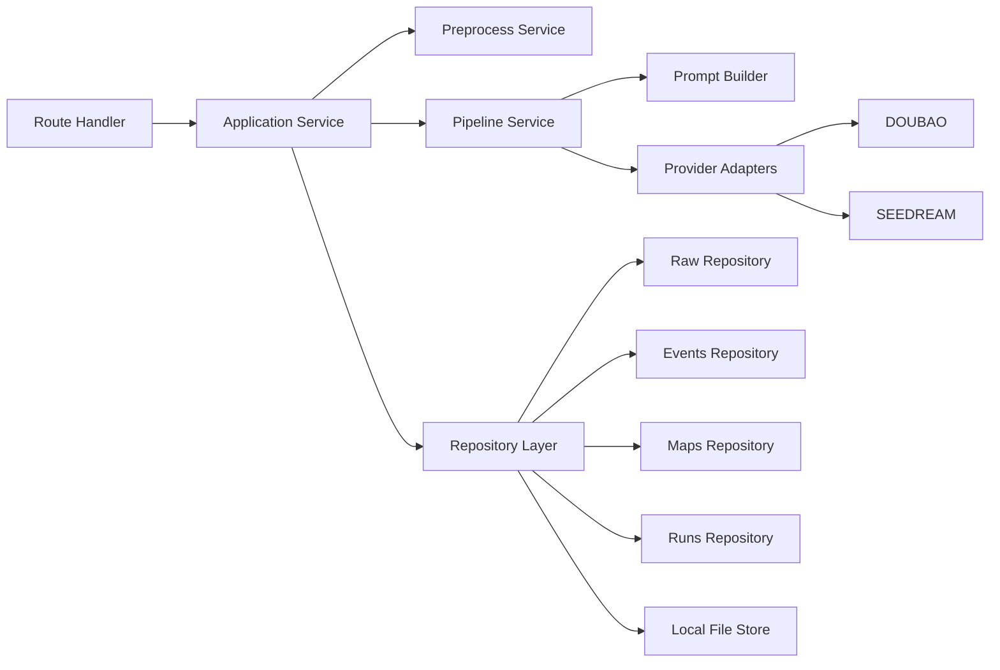
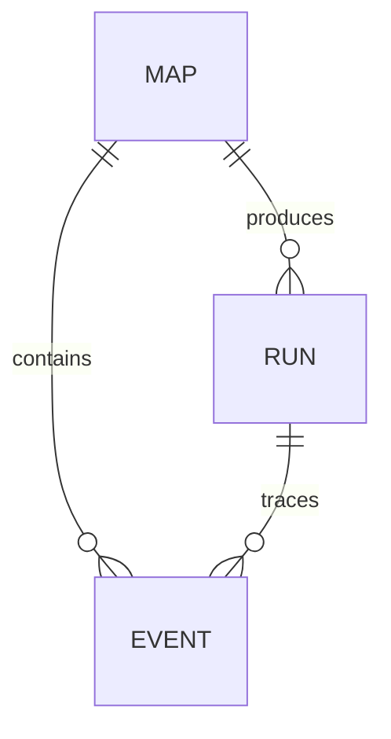

## 1. 架构设计

第一阶段采用**单应用分层架构**：前端页面、AI 引擎、仓库层、共享契约都在同一个 Next.js 工程内，但责任边界严格分离。运行时只依赖本地文件系统和外部 AI Provider，不接飞书线上存储；同时保留未来切换到飞书 `Maps / Events / Files / Runs` 的适配器边界。



### 1.1 目录责任划分

- `app/`：路由与页面装配，只负责入口和页面级组合。
- `src/features/`：页面域 UI、交互组件、展示层 view model。
- `src/engine/`：Part1 预处理、Prompt 资产、Provider 适配、P1~P5 编排。
- `src/server/`：本地仓库、文件读写、未来飞书适配边界。
- `src/contracts/`：跨层共享的 TypeScript 类型与 Zod 校验。

## 2. 技术说明

- 前端框架：`Next.js (App Router) + React + TypeScript`
- 样式系统：`Tailwind CSS`
- 数据契约校验：`Zod`
- Markdown 产物：原生字符串模板生成 `route.md`
- 运行时：`Node.js` 本地开发服务器
- 测试：`Vitest + React Testing Library`
- 初始化工具：`create-next-app`
- AI 接入：
  - 文本：`DOUBAO`
  - 生图：`SEEDREAM`
- 本地持久化：`public/mock/` 下的 JSON、Markdown、PNG/JPG、运行留痕文件

### 2.1 环境变量

首期只定义变量名，不把真实密钥写入仓库：

```bash
DOUBAO_API_KEY=
DOUBAO_ENDPOINT=
SEEDREAM_BASE_URL=
SEEDREAM_MODEL_ID=
SEEDREAM_API_KEY=
```

## 3. 路由定义

| 路由 | 用途 |
|------|------|
| `/` | 个人主页，展示作者信息与已生成地图卡片 |
| `/workspace` | 作者工作台，选择评论、配置地图并触发生成 |
| `/confirm/[mapId]` | 二次确认页，查看底片图并做重生成/确认保存 |
| `/maps/[mapId]` | 动态地图页，展示底片图、旅程轴和右侧评论卡 |
| `/runs` | 测试追踪页壳层，展示 run 列表与 6 类留痕占位 |

## 4. API 定义

第一阶段后端替身直接使用 Next.js 本地服务端运行时，不单独部署服务。所有页面只通过受控接口访问引擎和本地仓库，不直接拼接文件路径。

### 4.1 接口清单

| 接口 | 方法 | 说明 |
|------|------|------|
| `/api/preprocess/guangzhou` | `POST` | 从广州本地原始样本生成第②套 `event JSON` |
| `/api/maps/generate` | `POST` | 串联 P1、P2、P3，创建地图草案与运行留痕 |
| `/api/maps/[mapId]/regenerate` | `POST` | 按二次确认页输入触发 P4 重生成 |
| `/api/maps/[mapId]/confirm` | `POST` | 确认保存地图并固化 P5 输出 |
| `/api/maps/[mapId]` | `GET` | 获取地图详情、route 视图模型、事件列表 |
| `/api/runs` | `GET` | 获取 run 摘要列表 |
| `/api/runs/[runId]` | `GET` | 获取单次 run 的留痕详情 |

### 4.2 核心类型定义

```ts
type DemoRawPicture = {
  fileToken: string;
  name: string;
  localPath: string;
};

type RawReview = {
  recordId: string;
  createdAt: string;
  commentText: string;
  poiName: string;
  poiLocation: string;
  poiProvince: string;
  poiCity: string;
  poiDistrict: string;
  categoryL1: string;
  categoryL2: string;
  categoryL3: string;
  pictures: DemoRawPicture[];
};

type EventRecord = {
  eventId: string;
  commentId: string;
  day: string;
  time: string;
  commentText: string;
  commentPictures: { url: string; name?: string }[];
  poiName: string;
  poiLocation: string;
  poiProvince: string;
  poiCity: string;
  poiDistrict: string;
  categoryL1: string;
  categoryL2: string;
  categoryL3: string;
  authorName: string;
};

type MapRecord = {
  mapId: string;
  mapName: string;
  city: string;
  style: "young-cartoon";
  status: "draft" | "confirmed" | "failed";
  eventCount: number;
  routePath: string;
  posterPath: string;
};

type RunTrace = {
  runId: string;
  mapId: string;
  status: "running" | "completed" | "failed" | "incomplete";
  artifacts: {
    rawPath?: string;
    eventsPath?: string;
    routePath?: string;
    posterPath?: string;
    mapPath?: string;
  };
  errorMessage?: string;
};
```

### 4.3 Demo 兼容层策略

- `comment_id` 使用 Base `record_id`
- `author_name` 使用本地配置注入
- 飞书附件先稳定化到本地路径，再转换为 `commentPictures.url`
- 正式 BAM 恢复后，仅替换 `RawReviewLoader` 与 `DemoCompatibilityMapper`，不改页面与 P1~P5 接口

## 5. 服务端架构图



## 6. 数据模型

### 6.1 数据模型定义


```


- `MAP`：一次地图作品的聚合根，持有 route、poster、页面展示所需元数据。
- `EVENT`：由单条原始评论映射而来的第②套结构化记录，是动态地图页绑定的最小单位。
- `RUN`：一次生成或重生成任务的过程留痕，承载错误、产物路径、状态。

### 6.2 本地持久化清单（替代 DDL）

```text
public/mock/raw/guangzhou.raw.json
public/mock/events/guangzhou.events.json
public/mock/routes/{mapId}.route.md
public/mock/posters/{mapId}.png
public/mock/maps/{mapId}.json
public/mock/runs/{runId}.json
public/mock/files/comments/{commentId}_{index}.jpg
```

### 6.3 文件命名规则

- `mapId`：`map_gz_demo_001` 这类稳定可读 ID
- `eventId`：`evt_001` 起步，按预处理顺序递增
- `runId`：`run_YYYYMMDD_HHmmss_xxx`
- route 文件与 poster 文件都以 `mapId` 作为主键，避免多份草案混淆

## 7. 演进策略

- **阶段一（当前）**：本地 JSON + 文件目录 + 外部 AI Provider，确保 localhost 可跑通
- **阶段二**：以仓库接口为边界，把 `src/server/future-feishu/` 接到飞书 `Maps / Events / Files / Runs`
- **阶段三**：补齐测试追踪页真实留痕、权限与状态机，扩大数据规模
